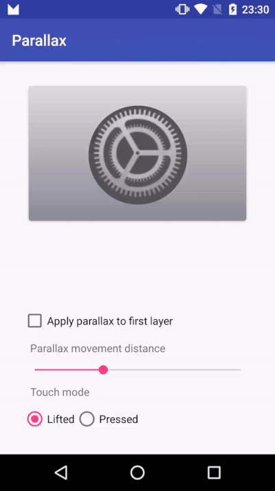

# Parallax
Easy parallax View for Android simulating Apple TV App Icons


## Installation

Parallax is available in the JCenter
```gradle
compile 'com.ablanco.parallax:parallax:{latest version}'
```
where `{latest version}` corresponds to published version in JCenter [  ](https://bintray.com/ablanco/maven/parallax/_latestVersion)

## How does it work?

Parallax works by adding ParallaxView instances to a ParallaxContainer.
Every ParallaxView should have LayerView instances as children.
To make the parallax effect happens, ParallaxView uses LayerView (that are no other than FrameLayouts with extra functionality) instances
and apply X/Y translations to them based on the index they have, where the smalles view index takes the greater parallax effect.

To start using Parallax, make your root view an instance of ParallaxContainer

```xml

    <?xml version="1.0" encoding="utf-8"?>
    <com.ablanco.parallax.ParallaxContainer xmlns:android="http://schemas.android.com/apk/res/android"
        android:layout_width="match_parent"
        android:layout_height="match_parent">

    </com.ablanco.parallax.ParallaxContainer>
            
```

Inside it, add instances of ParallaxView, where you can add instances of LayerView

```xml

<com.ablanco.parallax.ParallaxView
        android:id="@+id/parallaxView"
        android:layout_width="300dp"
        android:layout_height="200dp">

        <com.ablanco.parallax.LayerView
            android:layout_width="match_parent"
            android:layout_height="match_parent">
            
            ...
        </com.ablanco.parallax.LayerView>

        <com.ablanco.parallax.LayerView
            android:layout_width="match_parent"
            android:layout_height="match_parent"
            app:useParallaxPadding="false">
            
            ...
        </com.ablanco.parallax.LayerView>

        <com.ablanco.parallax.LayerView
            android:layout_width="match_parent"
            android:layout_height="match_parent">
           
            ...
        </com.ablanco.parallax.LayerView>


    </com.ablanco.parallax.ParallaxView>
            
```
As ParallaxView uses its LayerView index to apply parallax effect, the first LayerView added will be the farthest View from the user's perspective

Instances of LayerView can be added from code too

```kotlin
     val layerView = LayerView(this)
     layerView.addView(layerImage)
     parallaxView.addLayer(layerView)    
```

## Customization

ParallaxView can be customized in varios ways:

+ You can alternate between two touch modes: 
### PRESSED
Pressed touch mode will apply ParallaxView interaction as if the user were pressing the View, applying depth perspective rotation along user finger movement

### LIFTED
Quite the opposite to Pressed mode, ParallaxView will act as if it were sticky into user's finger, just like in Apple TV App Icons

```xml
    <com.ablanco.parallax.ParallaxView
        android:id="@+id/parallaxView"
        android:layout_width="300dp"
        android:layout_height="200dp"
        app:touchMode="lifted|pressed"/>         
```

Available from code too

```kotlin
        parallaxView.touchMode = ParallaxView.TOUCH_MODE_LIFTED | ParallaxView.TOUCH_MODE_PRESSED
```
+ You can change the parallax movement distance too, with is by default 5dp. The higher the value, the higher the parallax effect will be

```xml
    <com.ablanco.parallax.ParallaxView
        android:id="@+id/parallaxView"
        android:layout_width="300dp"
        android:layout_height="200dp"
        app:parallaxMovementDistance="10dp"/>       
```

And from code

```kotlin
        parallaxView.setParallaxMovementDistance(dstanceInPixels)
```

+ Last, but not least, you can change the behavior of the first layer from the user perspective. 
By default, last layer added will no apply any parallax effect, but you can change this behavior:

```xml
    <com.ablanco.parallax.ParallaxView
        android:id="@+id/parallaxView"
        android:layout_width="300dp"
        android:layout_height="200dp"
        app:firstLayerAppliesParallax="true|false by default"/>
```

```kotlin
        parallaxView.firstLayerAppliesParallax(true)
```

## Hey we are not done yet!

LayerView can be customized too by defining if its content will be padded. 
Because ParallaxView applies translation movements to achieve parallax effect, LayerView instances applies negative margins by default to ensure the Layer border will never be visible.
If any of your layers does not need this behaviour you can disable it (think as background images, which usually fills all the content, as Layers that need to have this behavior enabled):

```xml
 <com.ablanco.parallax.LayerView
            android:layout_width="match_parent"
            android:layout_height="match_parent"
            app:useParallaxPadding="false|true by default">
            ...
        </com.ablanco.parallax.LayerView>
```

```kotlin
        LayerView(this).useParallaxPadding = false
```

## Now we are done!

Check out the sample app and do not forget to star this repo if you find it useful!

License
=======

    Copyright 2017 Álvaro Blanco Cabrero
    Licensed under the Apache License, Version 2.0 (the "License");
    you may not use this file except in compliance with the License.
    You may obtain a copy of the License at

       http://www.apache.org/licenses/LICENSE-2.0

    Unless required by applicable law or agreed to in writing, software
    distributed under the License is distributed on an "AS IS" BASIS,
    WITHOUT WARRANTIES OR CONDITIONS OF ANY KIND, either express or implied.
    See the License for the specific language governing permissions and
    limitations under the License.
